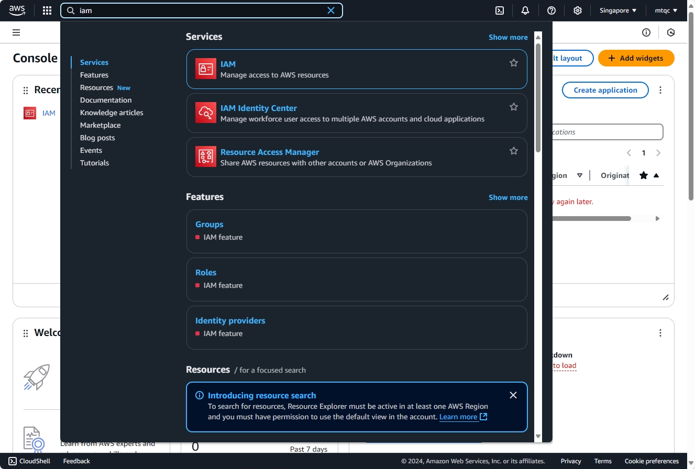

# Jenkins Guide

- [Jenkins Guide](#jenkins-guide)
  - [Goals](#goals)
  - [Introduction to Jenkins](#introduction-to-jenkins)
    - [Benefits](#benefits)
    - [Jenkins vs GitHub Actions](#jenkins-vs-github-actions)
  - [How-to: Set up Jenkins in AWS server](#how-to-set-up-jenkins-in-aws-server)
    - [I. Create an IAM User](#i-create-an-iam-user)
    - [II. Create a key pair](#ii-create-a-key-pair)

## Goals

- Understanding the advantages of Jenkins in CI/CD pipeline
- Understanding how to set up Jenkins in AWS Server
- Understanding how to create and manage jobs on Jenkins

## Introduction to Jenkins

> Jenkins is an open-source automation server that has become a cornerstone of Continuous Integration and Continuous Delivery (CI/CD) pipelines. At its core, Jenkins automates the building, testing, and deployment of software projects.

### Benefits

- **Extensible**: A vast ecosystem of plugins allows for seamless integration with various tools and technologies in your development workflow.
- **Customizable**: Jenkins can be tailored to fit your specific needs, whether you're working on small projects or large-scale enterprise applications.
- **Reliable**: Jenkins has a proven track record of stability and reliability, ensuring that your builds and deployments run smoothly.
- **Community-driven**: A large and active community provides support, resources, and ongoing development.

### Jenkins vs GitHub Actions

Feature | Jenkins | GitHub Actions
------- | ------- | ----------
**Open Source** | Yes | No
**Self-hosted** | Yes | Yes (with limitations)
**Cloud-based** | No | Yes (with GitHub-hosted runners)
**Integration** | Extensive plugin system | Seamless with GitHub
**Learning Curve** | Steeper | Gentler
**Customization** | Highly | Less than Jenkins
**Scalability** | Requires manual effort | Automatically with GitHub-hosted runners
**Cost** | Free (open-source) | Free tier with usage-based pricing for private repos

## How-to: Set up Jenkins in AWS server

*Refer to https://dev.to/aws-builders/how-to-set-up-jenkins-and-a-pipeline-on-aws-2pak*

> **Prerequities**: Already registered AWS user

### I. Create an IAM User

1. Navigate to **IAM**
   
2. Navigate to **Users** > Click **Create user**
3. Enter user name, click **Next**
4. Under **Permission options**, select **Attach policies directly**
   
5. Click **Create policy**, choose **JSON**
6. Paste the following script in JSON policy editor:
    ```
      {
      "Version": "2012-10-17",
      "Statement": [
          {
              "Sid": "Stmt1312295543082",
              "Action": [
                  "ec2:DescribeSpotInstanceRequests",
                  "ec2:CancelSpotInstanceRequests",
                  "ec2:GetConsoleOutput",
                  "ec2:RequestSpotInstances",
                  "ec2:RunInstances",
                  "ec2:StartInstances",
                  "ec2:StopInstances",
                  "ec2:TerminateInstances",
                  "ec2:CreateTags",
                  "ec2:DeleteTags",
                  "ec2:DescribeInstances",
                  "ec2:DescribeInstanceTypes",
                  "ec2:DescribeKeyPairs",
                  "ec2:DescribeRegions",
                  "ec2:DescribeImages",
                  "ec2:DescribeAvailabilityZones",
                  "ec2:DescribeSecurityGroups",
                  "ec2:DescribeSubnets",
                  "iam:ListInstanceProfilesForRole",
                  "iam:PassRole",
                  "ec2:GetPasswordData"
              ],
              "Effect": "Allow",
              "Resource": "*"
          }
      ]
      }
    ```
7. Click **Next**
   
8. Set **Policy name** as `JenkinsEC2Policy`, click **Create policy**
9. Go back to **Create user** browser tab
10. Under **Permissions policies**, select permissions: `AmazonS3ReadOnlyAccess` and `JenkinsEC2Policy`
11. Click **Next** > click **Create user**.

### II. Create a key pair

